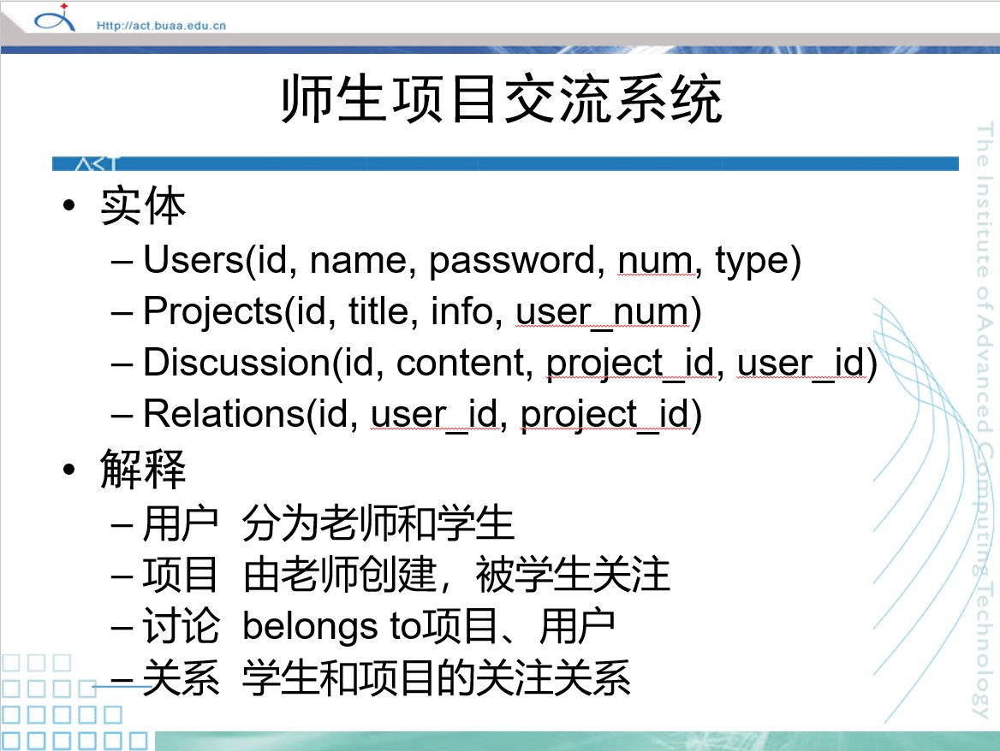
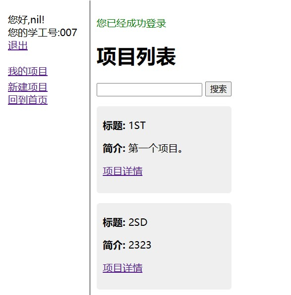
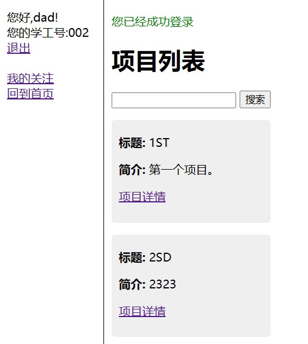

# 师生交流系统设计文档

## 项目介绍

本次ruby-rails设计为一个师生交流系统，老师可以增加、删除、修改项目，学生可以关注项目，老师和学生都可以通过搜索来查找项目，并通过项目进行交流。

整体架构如课上ppt图中所示：

以上四个实体完全实现，按照ppt中的要求有：

| 表     | 属性                   | 约束                                        |
| ------ | ---------------------- | ------------------------------------------- |
| 用户表 | id，用户名，密码，角色 | has_many :relations,programs                |
| 项目表 | id，标题，简介         | 外键：用户，has_many :discussions,relations |
| 讨论表 | id，讨论内容           | 外键：用户，项目                            |
| 关系表 | id                     | 外键：用户，项目                            |

## 操作介绍

本系统可以选择注册学生或者老师。

### 老师操作

可以添加/编辑/查看/删除项目。点击左边栏“我的项目”可以查看自己所创建的所有项目信息便于管理。在项目详情页面可以看见有多少学生正在关注这个项目。可以在项目的交流区和学生进行交流。

### 学生操作

可以搜索查看项目详情，对项目进行关注和取消关注的操作。点击左侧我的关注按钮可以看到自己关注的所有项目。可以在项目的交流区和其它学生老师进行交流。

### 游客操作

设置了游客可以进行的操作只有查看所有项目以及搜索项目，其他操作都需要用户登录后进行。